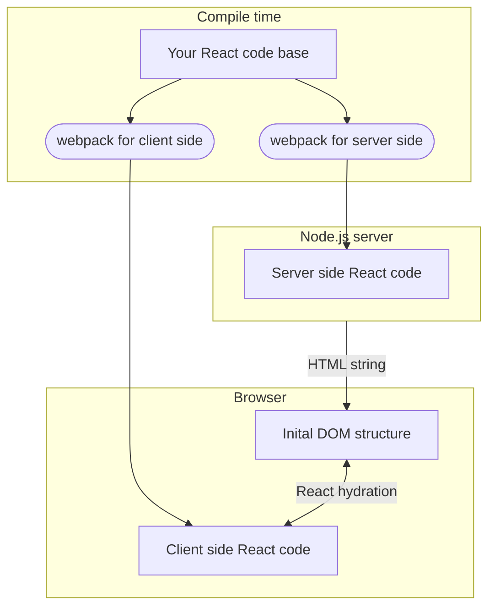
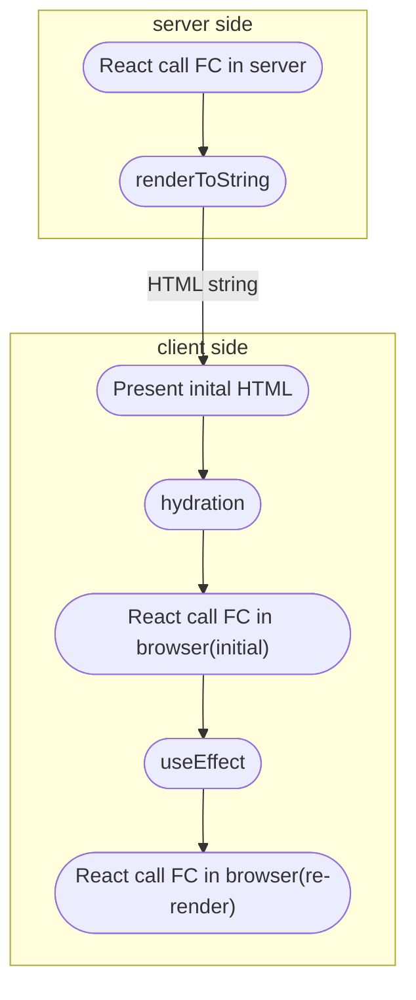

import { Callout, FileTree } from 'nextra/components'
import App1 from './ssr_App1';
import App2 from './ssr_App2';
 
這幾年Next.js興起下，大部份的中階開發者都已經知道要透過SSR去改進SEO和加速首次內容繪製時間(FCP, First Contentful Paint)。在這篇文章中，我們將理解在沒有使用Next.js或Remix.js的情況時，如何透過原生React進行SSR。

## 基本觀念 - hydration
在開始設置前，我們必須要知道React的SSR是在這個workflow下運作的:



你開發的React程式碼最終必須提供兩份，分別給server和client執行。

對於Server而言，React在server端進行的行為可以簡單理解為「使用React產生HTML字串」。你可以想像成我們用React在server side取代了過去傳統使用PHP來串接字串產生HTML的這個行為。

對於Browser而言，接收到的這個初始字串只是一個普通的HTML字串，並不是React程式。如果我們想在初次繪製畫面後，依然透過React進行SPA(完全以Javascript進行畫面的操作、事件互動等)，就必須要進行Virtual DOM的建立(比較初始字串和Client side React code中提供的DOM資訊，以Javascript的方式將這個樹狀結構記錄下來)、事件綁定......等。**這個過程稱為hydration**。React也提供了對應的API幫助開發者進行hydration。我們會在接下來的實作中介紹。

<Callout>
  如果你的程式在client side不需要透過React運作，你可以省略hydration。
</Callout>
<Callout type="error">
  因為最終server和browser必須使用兩份不同的程式碼，你其實可以使用兩份不同的React code base。但如果在兩份程式碼中的初始DOM結構不同時，React在hydration階段可能會產生錯誤導致無法正常運作。
</Callout>

## 環境設置

首先，我們必須要有一個Node.js server，並且在這個server上運行React。執行以下指令以安裝Express(Node.js web service框架)和React。
```bash
npm i express react react-dom
```

和開發client side React類似，我們必須要藉由babel和webpack將JSX編譯成node.js。如果希望共用React component的原始碼，也需要使用 `@babel/preset-env` 將ES6+的語法糖編譯。
```bash
npm i -D babel-loader @babel/core @babel/preset-react @babel/preset-env
```

安裝webpack
```bash
npm i -D webpack webpack-cli webpack-node-externals
```
<Callout type="info">
  本篇範例將統一使用esm開發,因此透過`webpack-node-externals`來解決cjs打包過程中可能產生的問題
</Callout>

## React in server side

請依照以下結構建立 `server.js`和 `App.js`

<FileTree>
  <FileTree.Folder name="src" defaultOpen>
    <FileTree.Folder name="pages" defaultOpen>
      <FileTree.File name="App.js" />
    </FileTree.Folder>
    <FileTree.File name="server.js" />
  </FileTree.Folder>
  <FileTree.File name="package.json" />
</FileTree>

`server.js`只是一個簡單的node.js web server。我們透過express監聽3000 port的所有http request。

```jsx
import express from 'express';

const app = express();
const port = 3000;

app.listen(port, () => {
  console.log(`Example app listening on port ${port}`)
})
```

在`App.js`中，我們建立一個基礎的React component，在裡面定義一個按一下就會加1的按鍵。我們將用這份程式碼來觀察hook和事件綁定在server和client side執行的差異。
```jsx
import React, { useState, useEffect } from "react";

export default function App() {
    const [count, setCount] = useState(0);
    const [mounted, setMounted] = useState(false);

    useEffect(() => {
        setMounted(true);
    }, []);

  return (
    <div>
      <div>count {count}</div>
      <button onClick={() => setCount((preCount)=> preCount + 1)}>add</button>
      { mounted && <span>I will only be rendered in client side</span> }
    </div>
  );
}
```

回到 `server.js`。如同前述，我們必須要將React產生的結構轉為字串並傳送給Browser。React提供了 `renderToString` 這個API幫助你完成這個過程。在 `server.js` 中，我們引入剛剛寫好的 `App.js`，並且將其傳入 `renderToString` 中。 當有人以GET拜訪我們的伺服器時，就以字串的方式將完整HTML結構回傳。
```jsx
import express from 'express';
import path from 'path';
import React from "react";
import { renderToString } from 'react-dom/server';

import App from './pages/App';

const app = express();
const port = 3000;

app.get('/', (req, res) => {
  let html = renderToString(<App/>);
  res.send(`
    <html>
      <head></head>
      <body>
        <div id="root">${html}</div>
      </body>
    </html>
  `);
})

app.listen(port, () => {
  console.log(`Example app listening on port ${port}`)
})
```

<Callout type="warning">
  在React 18後，React官方建議開發者使用 `renderToPipeableStream` 去取代 `renderToString` 以使用在React 18後推出的streaming和server side `<Suspend>`功能。我們會在後續文章中介紹。
</Callout>

到這一步，server端的程式碼已經開發完成。但是Node.js並不能辨識JSX語法，因此我們必須透過webpack和babel進行編譯。

請依照以下結構建立 `webpack.server.js` 和 `.babelrc`

<FileTree>
  <FileTree.Folder name="src" defaultOpen>
    <FileTree.Folder name="pages" defaultOpen>
      <FileTree.File name="App.js" />
    </FileTree.Folder>
    <FileTree.File name="server.js" />
  </FileTree.Folder>
  <FileTree.File name="package.json" />
  <FileTree.File name="webpack.server.js" />
  <FileTree.File name=".babelrc" />
</FileTree>

在`webpack.server.js`中，我們必須將 `target` 設為 `node` 以讓webpack知道要將程式碼打包成node.js的環境。其餘設定皆與client side類似。 在這邊我們設定從 `./src/server.js` 開始的程式碼會被打包在 `build/server.js` 下
```js
const path = require("path");
const nodeExternals = require('webpack-node-externals');

module.exports = {
  target: "node",
  entry: "./src/server.js",
  output: {
    filename: "server.js",
    path: path.resolve(__dirname, "build"),
  },
  module: {
    rules: [
      {
        test: /\.js$/,
        loader: "babel-loader",
        exclude: /node_modules/,
      },
    ],
  },
  // Resovle error: the request of a dependency is an expression
  externals: [nodeExternals()],
  resolve: {
    extensions: ['.js'],
  }
};
```

在`.babelrc`中建立以下內容
```js
{
    "presets": ["@babel/preset-env", "@babel/preset-react"]
}
```

最後回到`package.json`。加入以下兩個指令到`script`內:
```js
"scripts": {
    "server": "node build/server.js",
    "dev:server": "webpack --mode development --config webpack.server.js",
}
```

接著執行以下指令。這一步是使用webpack打包我們寫好的server端程式碼
```bash
npm run dev:server
```

最後透過以下指令用node.js執行剛剛打包好的程式碼
```bash
npm run server
```

開啟 `http://localhost:3000`，你會看到以下內容:

<App1/>

觀察執行結果，我們會發現:

1. 大部份DOM結構都有正確被渲染。但與 `useEffect` 有關的DOM結構(最下方依賴`mounted`的區塊)並沒有被渲染。
2. 點擊button沒有反應

這是因為`useEffect`只會在client side執行，而且我們還沒有傳送client side的React code到Browser進行hydration。node.js無法在server端進行事件綁定並將此對應資訊給瀏覽器，所以對於瀏覽器來說，目前能夠執行的只是一串一般的HTML字串而已。

## React in client side with hydration

React 18提供了`hydrateRoot`這個只能在client side使用的API來幫你進行hydration。

請依照以下結構新增 `client.js`和 `webpack.client.js`，這兩個檔案分別是我們在瀏覽器端的程式進入點和編譯設定。

<FileTree>
  <FileTree.Folder name="src" defaultOpen>
    <FileTree.Folder name="pages" defaultOpen>
      <FileTree.File name="App.js" />
    </FileTree.Folder>
    <FileTree.File name="server.js" />
    <FileTree.File name="client.js" />
  </FileTree.Folder>
  <FileTree.File name="package.json" />
  <FileTree.File name="webpack.server.js" />
  <FileTree.File name="webpack.client.js" />
  <FileTree.File name=".babelrc" />
</FileTree>

`hydrateRoot`的使用方式是在client side將原本我們習慣使用的`createRoot`取代為`hydrateRoot`，並同時傳入你的React程式進入點(通常為`<App/>`)。請在`client.js`中建立以下程式碼:

```jsx
import React from "react";
import { hydrateRoot } from 'react-dom/client';

import App from './pages/App';

const domNode = document.getElementById('root');
hydrateRoot(domNode, <App/>);
```

<Callout type="info">
  在React 17以前，必須要使用`hydrate`而不是`hydrateRoot`來進行hydration。
  ```jsx
  import React from "react";
  import { hydrate } from 'react-dom';

  import App from './pages/App';

  const domNode = document.getElementById('root');
  hydrate(<App/>, domNode);
  ```
  和`hydrateRoot`不同的地方在，`hydrate`允許Server side render的DOM和client side初始render的DOM存在差異。但使用`hydrate`渲染的DOM會無法使用React 18後推出的新功能(e.g: streaming)。
</Callout>

接著，由於執行環境從伺服器換到了瀏覽器，我們要在`webpack.client.js`中將將 `target` 設為 `web`。其餘設定皆和server side設定檔接近，唯一明顯差異是不需要引入`externals: [nodeExternals()],`

<Callout type="info">
  在此範例中，client side程式碼相依不會有cjs打包的問題，因此不需要`webpack-node-externals`
</Callout>

```js
const path = require("path");

module.exports = {
  target: "web",
  entry: "./src/client",
  output: {
    filename: "client.js",
    path: path.resolve(__dirname, "build"),
  },
  module: {
    rules: [
      {
        test: /\.js$/,
        loader: "babel-loader",
        exclude: /node_modules/,
      },
    ],
  },
  resolve: {
    extensions: ['.js', '.jsx'],
  }
};
```

最後，回到`package.json`，加入`dev:client`這個使用webpack編譯並執行開發伺服器的指令。

```js
"scripts": {
    "server": "node build/server.js",
    "dev:server": "webpack --mode development --config webpack.server.js",
    "dev:client": "webpack --mode development --config webpack.client.js",
    "test": "echo \"Error: no test specified\" && exit 1"
}
```

執行 `npm run dev:server`和 `npm run dev:client` 各一次後，執行 `npm run server`，你就能看到以下結果，各個元件都能正常地在瀏覽器中接收和發送事件:

<App2/>

觀察執行結果，我們會發現React是依照以下流程運作的:


